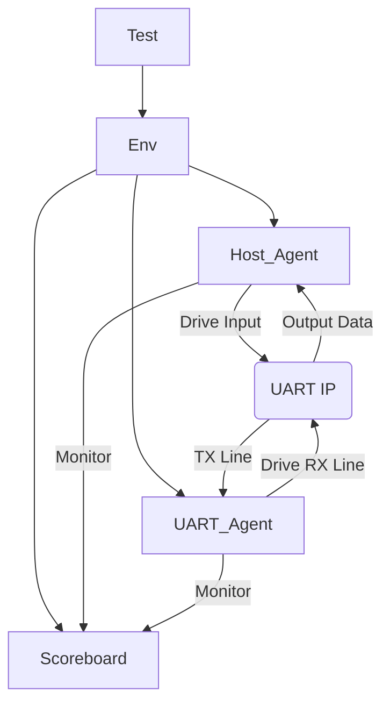

# UVM Verification Environment for UART IP

## 📖 项目简介 (Introduction)

本项目是一个基于 **UVM (Universal Verification Methodology)** 搭建的验证环境，用于验证 **UART (Universal Asynchronous Receiver/Transmitter)** IP 核的功能。

该环境采用了 **双 Agent 架构 (Dual-Agent Architecture)**，能够完整覆盖 UART 的发送 (TX) 和接收 (RX) 功能，并实现了自动化的数据比对 (Scoreboard) 和 覆盖率收集。

### 🔑 关键特性 (Key Features)

* **双 Agent 架构**:
    * `Host Agent`: 模拟 CPU 行为，驱动 `tx_start/tx_data` 等控制信号，验证 IP 的 TX 通路。
    * `UART Agent`: 模拟外部串口设备，驱动 `uart_rx` 串行信号，验证 IP 的 RX 通路。
* **自检机制 (Self-Checking)**: 集成 `Scoreboard`，利用 Reference Model (Queue) 自动比对期望数据与实际数据。
* **多场景测试**: 包含 Sanity Test (冒烟测试), Loopback Test (回环测试), Random Test (随机测试) 等。
* **自动化脚本**: 提供 `Makefile` 支持一键编译、仿真和打开波形。

---

## 🏗️ 验证架构 (Verification Architecture)

·DUT: 8-bit Data, No Parity, 1 Stop Bit (8N1).

·Driver: 实现了波特率发生逻辑，模拟真实的异步传输时序。

·Monitor: 实现了基于过采样 (Oversampling) 的中心对齐采样逻辑，抗干扰能力强。

📂 文件结构 (File Structure)
Plaintext

.
├── rtl/                # Design Source Code (UART IP)
│   ├── uart_top.v
│   ├── uart_rx.v
│   └── uart_tx.v
├── uvm_tb/             # UVM Verification Environment
│   ├── agents/         # Agents (Driver, Monitor, Sequencer)
│   ├── env/            # Environment & Scoreboard
│   ├── tests/          # Test Cases
│   └── tb_top.sv       # Top Module
├── sim/                # Simulation Directory
│   ├── Makefile        # Run scripts
│   └── filelist.f      # File list
└── README.md           # Project Documentation
🚀 如何运行 (How to Run)
本项目基于 Synopsys VCS 和 Verdi 进行开发。

1. 预备工作
确保你的服务器环境已安装 VCS 和 UVM 库。

2. 运行仿真
进入 sim 目录：

Bash

cd sim
运行编译和仿真 (Run Compilation & Simulation):

Bash

make run
(默认运行 sanity test，如需运行其他 test，修改 Makefile 或传参)

查看波形 (Open Waveform):

Bash

make wave
清理垃圾文件 (Clean):

Bash

make clean
📊 验证结果 (Simulation Results)

